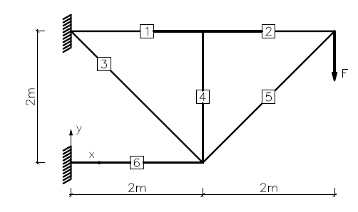

# StableTrussOpt-MATLAB
[](https://www.gnu.org/licenses/old-licenses/lgpl-2.1.html)


StableTrussOpt-MATLAB is a program of 3D truss structure optimization with global stability constraints in MATLAB. For structural analysis, the frame elements are used to capture true 3D behavior. Then the problem is solved as a sizing optimization task formulated as a SDP program with polynomial constraints:

$$\min_{\bf{A} \in \mathbb{R}^{ne}} \qquad \bf{A}^T\bf{L} $$

$$\text{s.t.} \quad \bf{I}_{y,z,x} = \mathcal{P}(\bf{A}) ,$$

$$(\bf{K}e(\bf{A},\bf{I}_{y,z,x}) + \bar{\lambda} \bf{K}g) \succeq 0 ,$$

$$ A_i \ge A_{min} , \forall i.$$


The whole program is executed on an example given in (Torii et al., 2015):


For educational and research purposes, license for using StableTrussOpt-MATLAB is free of charge.
For commercial purposes, please contact program developers.


Copyright (C) 2024 Matěj Lepš, Šimon Glanc


### Pre-requisites

* In addition to Matlab it is essential to have installation of YALMIP (https://yalmip.github.io/) and PENLAB (https://web.mat.bham.ac.uk/kocvara/penlab/) .

## Running StableTrussOpt-MATLAB
Only the stability analysis
```
>> towerStabTorii_ex0_stab1
```
The whole optimization
```
>> towerStabTorii_ex0_opt1
```

## Documentation
Documentation/user manual is available [here](.pdf).


## References
Torii, A.J., Lopez, R.H. &amp; Miguel, L.F.F. Modeling of global and local stability in optimization of truss-like structures using frame elements. <i>Struct Multidisc Optim</i> <b>51</b>, 1187–1198 (2015). https://doi.org/10.1007/s00158-014-1203-y

## Authors
[Matěj Lepš](mailto:matej.leps@fsv.cvut.cz) <br/>
[Šimon Glanc](mailto:simon.glanc@fsv.cvut.cz) <br/>

## Acknowledgments
Financial support for this work was provided by the Technology Agency of the Czech Republic (TAČR), project number FW04020163 (Extension of the HiStruct platform by optimisation of global stability and analysis of design
combinations).
